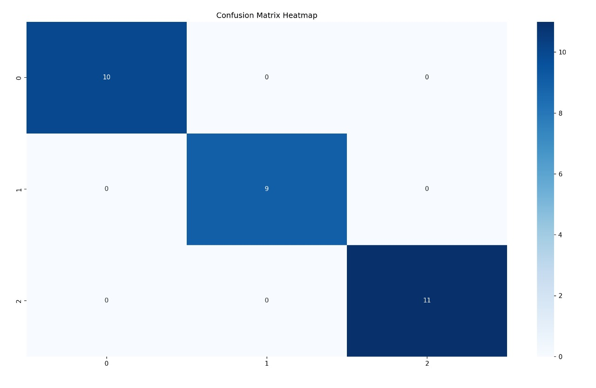

# Iris: Machine Learning-Based Flower Classification

In order to categorize iris flowers into three species—Setosa, Versicolor, and Virginica—a machine learning model must be constructed. Over 90% accuracy is attained by the model, which employs a Decision Tree algorithm.

## 📚 Tools Used: Matplotlib, Scikit-learn, NumPy, Python, Pandas, and Seaborn

## 🔥 The Iris dataset was loaded from scikit-learn.
The data was preprocessed and divided into training and testing sets.
A decision tree classifier was trained.
Model performance was assessed using the confusion matrix, classification report, and accuracy score.
Heatmaps were used to visualize the outcomes.

## 🚀 How to Run
1. Make a clone of the repository.
2. Set up dependencies:

## 📊 Sample Output

